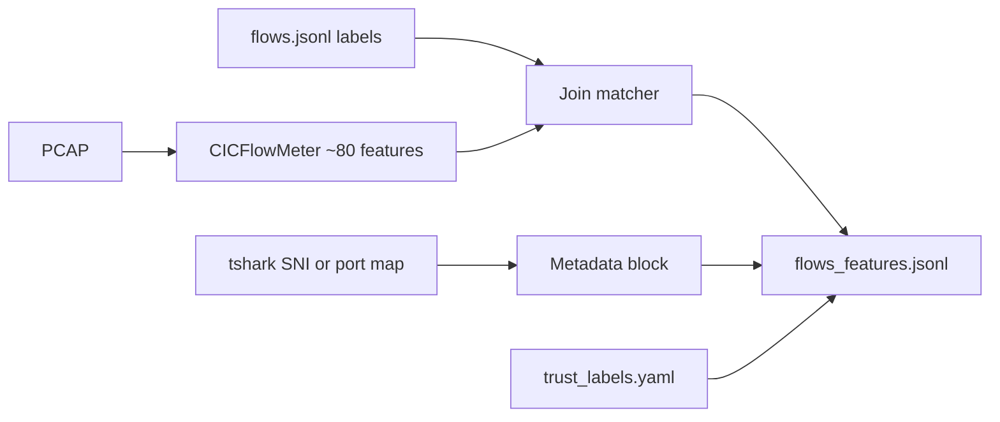

# Phase 2 — Capture & CICFlowMeter Features

## What Phase 2 does

Phase 1 produced **labeled traffic** and (optionally) a **PCAP**. Phase 2 turns raw packets into **structured feature records** the rest of the system can reason over:



| Step | Output | Trust |
|------|--------|-------|
| CICFlowMeter | `flow_duration`, `tot_fwd_pkts`, IAT stats, … | **trusted** (measured) |
| Metadata | `sni`, `alpn`, … | **untrusted** (attacker-controllable) |
| Join | `ground_truth.traffic_class`, `attack_type` | label oracle (Phase 1) |

**Why CICFlowMeter:** comparability with CIC-IDS2017/2018 baselines and published QUIC-IDS work (IEEE TNSM 2025). **Cite** the CICFlowMeter tool paper in methods.

**Why metadata separately:** SoK finding — encrypted payload alone is insufficient; header/metadata (SNI) matters, and in our threat model SNI is the injection surface for Phase 7.

## One-shot (recommended)

```powershell
veritas-testbed generate --record-pcap
veritas-capture process
veritas-capture summary
```

`--record-pcap` uses **tshark** on the loopback adapter when available (same as manual capture).

**Note:** tshark needs ~1.5s to attach; the CLI waits before sending traffic so benign flows on port 4433 are included.

## Outputs

| File | Purpose |
|------|---------|
| `data/processed/features/flows_features.jsonl` | Twin/agent input (Phase 3+) |
| `data/processed/cicflowmeter/<pcap>_cicflowmeter.csv` | Raw CICFlowMeter export for baselines |

## Label deduplication

If you ran `veritas-testbed generate` multiple times, `flows.jsonl` has duplicate scenarios. Default strategy `last_per_scenario_port` keeps the **latest** label per `(scenario_id, dst_port)` when joining.

## Capture tip (Windows)

Terminal 1:
```powershell
tshark -i "Adapter for loopback traffic capture" -f "udp port 4433 or udp port 4434 or udp port 4435" -w data\raw\pcap\phase1.pcapng
```

Terminal 2:
```powershell
veritas-testbed generate
```

## Next: Phase 3

Digital twin Tier 1 ingests **measured** CICFlowMeter fields + host history — not metadata strings — as the tamper-resistant oracle.
