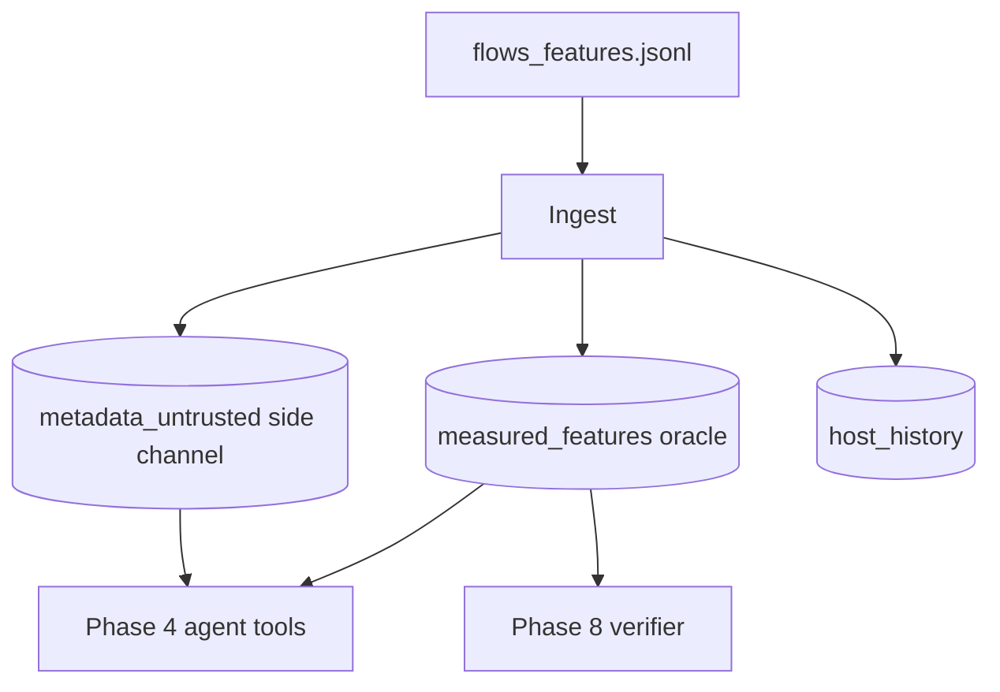

# Phase 3 — Digital Twin Tier 1 (Measured Trust Anchor)

## What Phase 3 does

Phase 2 produced **enriched feature records** (`flows_features.jsonl`). Phase 3 splits them into two trust zones inside a **digital twin oracle**:



| Store | Contents | Trust | Used by |
|-------|----------|-------|---------|
| `flows.measured_features` | CICFlowMeter fields tagged `trusted` | **Measured** — oracle | Verifier, ML baseline |
| `metadata_untrusted` | SNI, ALPN, … | **Untrusted** — attacker surface | Agent (via `get_metadata`) |
| `host_history` | Per-IP flow events from measured bytes | **Measured** | Agent `get_host_history` |

**Your delta vs CaMeL/dual-graph:** IFC prior art labels trust at the prompt boundary statically. Here trust is anchored in **instrumentation** the attacker cannot edit (twin built from CICFlowMeter, not from SNI strings).

## Commands

```powershell
# Ingest Phase 2 output into twin DB
veritas-twin ingest

# Query oracle (same API surface Phase 4 agent tools will use)
veritas-twin summary
veritas-twin flow <flow_id>
veritas-twin metadata <flow_id>
veritas-twin host 127.0.0.1

# Metadata-ablation replay (Phase 8 fingerprint)
veritas-twin replay <flow_id>
```

## End-to-end from Phase 1

```powershell
veritas-testbed generate --record-pcap
veritas-capture process
veritas-twin ingest
veritas-twin summary
```

## Tier 2 (stretch)

Predictive simulation (`query_twin(action, flow)`) is **not** implemented in Tier 1. Document as future work in the paper.

## Next: Phase 4

Build the IDS-Agent-style LLM defender with tools:
- `get_flow_stats(flow_id)` → twin measured oracle
- `get_metadata(flow_id)` → untrusted side channel
- `get_host_history(ip)` → twin host history
