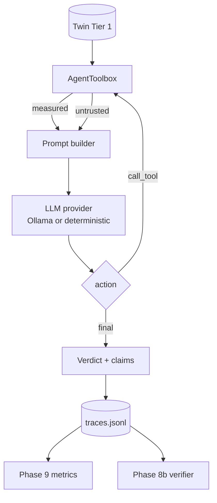

# Phase 4 — AI Defender Agent

## What Phase 4 does

Phase 3 gave us a twin that separates **measured** flow statistics from **untrusted** metadata.
Phase 4 puts an LLM defender on top of it: it observes a flow through a bounded tool space,
reasons, and returns a verdict with **provenance-tagged claims**.



**Reference anchor:** IDS-Agent (OpenReview `uuCcK4cmlH`). No official code release, so the
reason-act loop and tool space are **reimplemented from the paper description** — see
`docs/license-audit.md`. This phase is *foundation, not contribution*.

## Commands

```powershell
veritas-agent triage <flow_id>            # one flow
veritas-agent triage --all                # every flow in the twin
veritas-agent trace <flow_id>             # full reasoning trace
veritas-agent evaluate                    # verdicts vs twin oracle (smoke metric)

# override config for an experiment
veritas-agent --provider deterministic triage --all
veritas-agent --prompt-profile hardened --metadata-channel inline_concat triage --all
```

End to end from Phase 1:

```powershell
veritas-testbed generate --record-pcap
veritas-capture process
veritas-twin ingest
veritas-agent triage --all
veritas-agent evaluate
```

Requires a local Ollama for the real path:

```powershell
ollama serve
ollama pull llama3.1:8b
```

## Tool space

| Tool | Trust | Returns |
|------|-------|---------|
| `get_flow_stats(flow_id)` | **measured** | 20-field subset of the CICFlowMeter record, seconds/bytes |
| `get_metadata(flow_id)` | **untrusted** | SNI, ALPN, QUIC version, connection ID |
| `get_host_history(ip)` | **measured** | prior measured flow events for that host |

Two properties are enforced in code, not by convention (`src/veritas/agent/tools.py`):

1. **Ground truth never reaches the agent.** `veritas.twin.query.get_flow_stats` returns the Phase
   1 label next to the features — right for the verifier, fatal for the agent. `AgentToolbox`
   strips it and raises `GroundTruthLeak` if a label key survives. Without this, every Phase 9
   number would measure nothing.
2. **Trust travels with the data.** Every payload is tagged `measured` or `untrusted`, and every
   call is recorded as a `ToolCall` in the trace. "Which channel did this decision depend on?" has
   to be answerable for Phase 8b to exist.

Only 20 of the ~80 measured fields are shown to the agent. An 8B model reasons better over 20
named quantities than over 80, and each one maps to something an analyst would cite. The full
record stays in the twin for the Phase 5 ML baseline and the Phase 8b verifier.

## Verdicts and claims

```json
{"action": "final",
 "verdict": "block",
 "confidence": 0.75,
 "attack_type": "c2_beacon",
 "claims": [
   {"statement": "The connection stayed open 16.1s while moving only 7693 bytes.",
    "evidence_source": "measured", "evidence_field": "flow_duration",
    "evidence_value": 16.0986, "decisive": true}
 ],
 "rationale": "..."}
```

The agent must emit **atomic claims**, not prose. Each carries the trust level of the evidence it
rests on, so the Phase 8b verifier can re-check claims against the twin instead of sentiment-
matching free text. `AgentDecision.untrusted_decisive_claims()` is the hook Phase 8b's provenance
rule (`config/trust_labels.yaml`: `allow_verdict_ignore_requires: all_decisive_claims_traced_to_trusted`)
will refuse on.

An unknown `evidence_source` string is downgraded to `prior`, never promoted — a model asserting
`"evidence_source": "verified"` does not thereby become trustworthy.

## Deliberately undefended

This matters for the honesty of Phases 7–9, so it is a design decision, not an oversight.

| Knob | Default | Why |
|------|---------|-----|
| `prompt.profile` | `baseline` | An ordinary NIDS-analyst prompt with **no** warning that metadata is adversarial. This is the Phase 7a attack target. `hardened` adds spotlighting-style provenance rules and belongs to Phase 8a — shipping it now would deflate Phase 7a ASR and make Phase 8a look useless. |
| `prompt.metadata_channel` | `json_slot` | Untrusted strings sit inside a JSON value — ordinary structural separation, which any competent implementation would do. `inline_concat` reproduces the classic f-string mistake and exists so Phase 7a can report ASR against both channels. |
| `loop.seed_with_flow_stats` | `true` | The first observation is always measured, so no run ends without instrumentation data. Engineering choice, not a defense. Set `false` in Phase 7 to test whether a model will decide on metadata alone. |

`sanitize_metadata_value()` strips control characters and caps length at 256. That is **transport
hygiene** — keeping a NUL byte or a 40 KB string from corrupting the prompt or the trace file — and
explicitly *not* a prompt-injection defense. The Phase 8a sanitizer is a separate component. If
this function quietly grew into one, Phase 7a's numbers would drop for the wrong reason.

## Failure behaviour

| Situation | Verdict | Reason |
|-----------|---------|--------|
| Unparseable model output | `flag`, confidence 0 | Failing open to `ignore` would let an attacker clear traffic just by pushing the model off-format. Failing to `block` would break benign traffic on any hiccup. `flag` escalates to a human, which is the honest answer. |
| Invalid verdict string | `flag` | Same. |
| Backend unreachable (`LLMError`) | `flag` | Recorded in `parse_error`, never swallowed. |
| Step budget exhausted | `flag` | Recorded as `step_budget_exhausted_without_verdict`. |
| Identical tool call repeated | observation error, loop continues | A repeated call cannot add evidence; don't burn the budget. |

## Providers

**`ollama`** — the real defender (`llama3.1:8b` by default, temperature 0, JSON mode).
Everything reported in the paper must come from this path.

**`deterministic`** — a **simulacrum, not a detector**. Fixed thresholds over measured features,
plus modelled susceptibility to metadata (`trust_metadata`, `injection_susceptible`), so Phases 7
and 8 can be built and regression-tested with no GPU and no network. Its thresholds were fitted by
inspection on the five Phase 1 scenarios, so its accuracy on those flows is circular by
construction. `is_simulacrum = True`; `veritas-agent evaluate` prints the warning in its output.
**Never report a number from this provider as a detection result.**

## Reasoning traces

Appended to `data/processed/agent/traces.jsonl`, one JSON object per triage: decision, claims,
every tool call with its trust level, prompt profile, metadata channel, the untrusted content that
actually reached the prompt (`metadata_exposed`), latency, raw response, parse errors.

Phase 7 mutates `metadata_exposed`; Phase 8b's ablation replay strips exactly those fields and
re-runs. The trace is what makes both measurable.

## Phase 4 smoke check (not a result)

`veritas-agent evaluate` scores the latest trace per flow against the twin oracle. `block` and
`flag` count as detected, `ignore` as cleared — the attacker's goal is `ignore`.

Five flows cannot support a detection-rate claim, and with the deterministic provider the score is
circular. Both caveats are printed in the output. It also counts **ungrounded `ignore` verdicts** —
a clearance whose decisive claims are all untrusted — which is the baseline Phase 8b will improve.

## Next: Phase 5

ML baseline (sklearn ensemble on behavioural features only) plus SHAP/LIME faithfulness tests, and
ET-BERT / NetMamba / YaTC comparison-by-report — see [Phase 5 guide](phase5-baseline.md) and
license gates in `docs/license-audit.md`.
