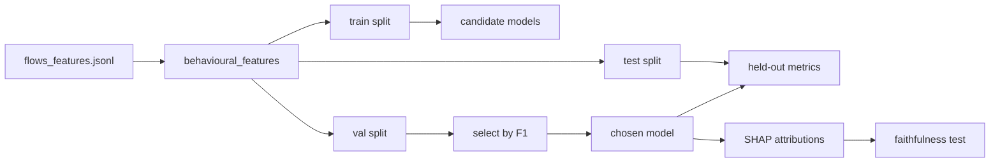

# Phase 5 — ML Baseline and Explainability

## What Phase 5 does

Gives the agent something to be compared against, and turns "the model explains itself" from a
claim into a measurement.



## Why sklearn and not NetMamba

`docs/license-audit.md` records the constraint: **NetMamba and YaTC ship no LICENSE file**, so
their code cannot be copied. ET-BERT is MIT but is a payload-token model — it consumes packet byte
sequences, not flow statistics, so it would not be running on the same input as the agent.

The honest baseline is therefore a standard tabular ensemble (random forest / gradient boosting /
logistic regression, selected on validation F1) over the **identical feature view the agent sees**,
with the published transformer numbers cited as compare-by-report rather than re-run.

That is a real limitation and belongs in the paper's limitations section. It is also not fatal to
the argument: the claim under test is about reasoning manipulation, and the baseline's job is to
show what a detector *without* a reasoning channel does under the same attacks. A stronger backbone
would move the detection ceiling; it would not change the fact that Phase 7 cannot touch a model
that never reads a justification.

## Commands

```powershell
veritas-baseline train                      # fit candidates on train, select on val
veritas-baseline evaluate --split test      # the only publishable numbers
veritas-baseline evaluate --split test --variant baseline_1.0   # under evasion
veritas-baseline explain --split test       # SHAP global importance
veritas-baseline faithfulness --split test  # do the attributions actually drive the decision?
```

## The leak-free feature view

Everything the model sees passes through `veritas.features.behavioural_features()`. The twin keeps
the five-tuple and the capture clock because replay needs them; the model never sees them, because
in this testbed `dst_port` **is** the label. See `docs/test-plan.md` for the full account.

Constant columns are dropped (no signal, and they break some explainers). Infinities — CICFlowMeter
emits them for rates on near-zero-duration flows — are mapped to 0.

## Two heads

| Head | Target | Used for |
|------|--------|----------|
| binary | benign vs malicious | detection rate, FPR, attack success rate |
| attack type | c2_beacon / data_exfil / scan_probe | per-attack breakdown |

## The faithfulness test

An attribution method always returns *something*. SHAP will rank features for a model that ignores
them. So the deliverable is not a bar chart, it is an experiment:

1. Take the top-k features SHAP says drove each decision.
2. Replace exactly those with the column median — "this flow was unremarkable there".
3. Measure how often the prediction flips.
4. **Control arm:** ablate k *randomly chosen* features instead.

Only the gap between the two arms is evidence. Ablating any k features moves some predictions; if
the cited features move no more than random ones, the explanation was decoration — and that is a
finding to report, not to bury.

Median rather than zero, because zero is itself an extreme value for most CICFlowMeter columns and
would overstate the effect.

This also underwrites Phase 8b. The verifier assumes a stated reason can be checked against
evidence; this is the experiment that establishes the assumption holds on the ML side.

## Agent vs ML explanation agreement

`compare_agent_claims_to_shap()` asks whether the agent's decisive claims name features SHAP also
ranks highly. Agreement is weak evidence both are grounded. Disagreement — a decisive agent claim on
a feature the model finds irrelevant — is where Phase 7's manipulation shows up first.

## Compliance

- **Cite:** NetMamba (arXiv:2405.11449), ET-BERT (arXiv:2202.06335), YaTC (AAAI 2023) as baseline
  comparison points; scikit-learn, SHAP, LIME as tools.
- **Do not clone** NetMamba or YaTC — no LICENSE. ET-BERT (MIT) may be cloned if you later want a
  payload-model comparison.
- CIC datasets are optional sanity data only; store terms in `data/external/_terms/` before
  downloading.

## Next: Phase 6

Reshape malicious traffic until the measured features look benign, and measure how far the
baseline and the agent fall.
