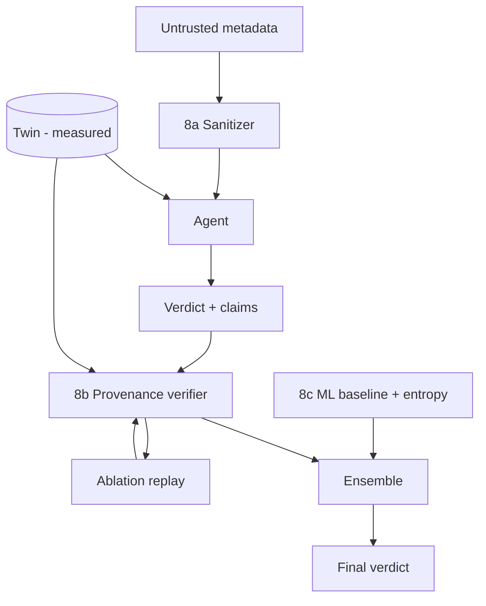

# Phase 8 — Defense in Three Layers

Each layer closes a different gap, and the interesting part is being precise about which layer
closes which — a defense that cannot say what it does *not* stop is a defense nobody can evaluate.



---

## 8a — Input sanitization *(reference)*

Reimplemented from the **patterns** in StruQ (structured separation of instruction and data
channels) and Spotlighting (delimit tool results, instruct the model to ignore instructions inside
them). Neither codebase is copied: StruQ's repo license reads "Other", Meta SecAlign's code is
CC-BY-NC. Both recorded in `docs/license-audit.md`. Cite the papers; the implementation is ours.

What it does: strips control characters, caps length, enforces a hostname grammar, and quarantines
values matching imperative / authority / role-marker patterns. The original is preserved in the
trace — silently rewriting attacker text would hide the attack from the evidence.

**Measured effect** (Phase 9 `injection`):

| Attack | ASR undefended | ASR behind 8a |
|--------|---------------|---------------|
| 7a naive | 0.40 | **0.00** |
| 7b grounding-aware, bracketed | 0.81 | **0.00** |
| 7b adaptive, valid hostname | 0.75 | **0.75** |

The middle row is a win against an *encoding*, not against an idea: the bracketed payload is not a
valid hostname, so the grammar check rejects it. An attacker who reads this defense writes the same
true measurements as DNS labels — `backup-window-16.1s-tx-4kb-pkts-27.nightly.internal.test` —
and 144 of 144 such payloads pass unmodified. Reporting only the bracketed number would have
overstated this layer by the full 0.75. `tests/test_defense.py` pins the gap so it cannot close by
accident.

---

## 8b — Provenance-tracked reasoning verifier *(CORE)*

One rule:

> A verdict of `ignore` is accepted only if every decisive claim traces to a **measured** source
> the attacker cannot author.

### What is prior art, and what is not

Information-flow control for agents is **not** new, and the paper says so plainly:

| Prior art | What it does |
|-----------|--------------|
| **CaMeL** | defeats prompt injection by design; capability/label discipline at the prompt boundary |
| **AgentArmor** | program analysis over the agent's runtime trace |
| **Dual-graph provenance** | propagates authorization labels through a graph |
| **Melon** | masked re-execution |
| **Progent** | privilege control for agent actions |

All cite-only. **The delta is where trust comes from.** Those systems assign trust *statically at
the prompt boundary* — this argument arrived via a tool, therefore it is data. Veritas anchors trust
in an **independently measured oracle**: the Tier-1 twin, built from packet instrumentation, which
the attacker can influence only by changing their actual traffic. A claim is trusted not because of
where it sat in the prompt, but because the twin independently measured it.

That is what defeats 7b. A grounding-aware payload states true facts, so a consistency checker
confirms them and clears the flow. The provenance check asks a different question — *who authored
the basis for this decision* — and an attacker-supplied string fails it however accurate it is.

### Three checks per verdict

1. **Grounding** — does the claim's cited field exist in the twin, with the stated value (5%
   tolerance)? → `grounded` / `contradicted` / `unsupported`
2. **Provenance** — do the decisive claims come from measured sources? → `untrusted_source`
3. **Ablation replay** — re-run with untrusted metadata stripped. A verdict that flips was
   metadata-dependent by definition. This is the fingerprint the twin uniquely enables, because
   replay needs a faithful record of what was measured.

An unrecognised `evidence_source` label is downgraded to `prior`, never promoted — a model asserting
`"evidence_source": "verified"` does not thereby become trustworthy.

The rule constrains **clearance only**. Escalation needs no provenance defense: the attacker's goal
is `ignore`, and a defense that blocked traffic on untrusted grounds would be a denial-of-service
surface of its own.

### The cost

`veritas-eval run --only false_alarms` measures how often the verifier overrides an honest, correct
`ignore` on benign traffic with no injection at all. A defense with no false-alarm number is not a
result. Replay roughly doubles per-flow latency because it re-runs the agent — with a real LLM that
is a real cost, reported as a multiplier on inference rather than as milliseconds measured against a
microsecond-fast stand-in.

### The ablation that makes the paper

`ProvenanceVerifier(use_twin=False)` runs the identical logic with the measured anchor removed.
Claims can then only be checked against the label the agent gave its own evidence — which the
attacker influences. If the numbers hold up without the twin, the twin is not the contribution and
the paper should say so. `tests/test_defense.py::test_twin_ablation_weakens_the_verifier` pins the
expected direction.

---

## 8c — Feature hardening and ensemble *(reference)*

**Entropy features** (`veritas-capture process --entropy`) are computed from packets, not from the
flow summary: Shannon entropy of the packet-size distribution (forward, backward, combined),
normalised entropy, distinct-size count, top-size share, and quantised inter-arrival entropy.
Phase 6 moves aggregates; distribution *shape* is much harder to fake at the same time. These are
measured fields, so they are trusted and admissible.

**Ensemble** combines the ML baseline's probability with the agent's verdict. `or_flag` is the
default — clearing a flow requires *both* components to be fooled, which is the right asymmetry when
the attacker's goal is `ignore`. It buys attack resistance with false positives, and both numbers
are reported.

The two detectors fail in different directions, which is the entire reason to combine them: the ML
model never reads a justification, so Phase 7 cannot touch it; the agent reasons over several
features at once, so Phase 6 moves it less.

## Commands

```powershell
veritas-eval run --only injection      # every layer, per attack tier
veritas-eval run --only false_alarms   # the cost side
veritas-eval run --only ensemble       # 8c strategies
```

## Next: Phase 9

Run all of it, hold out what the defense never saw, and report the adaptive-attacker number
honestly.
